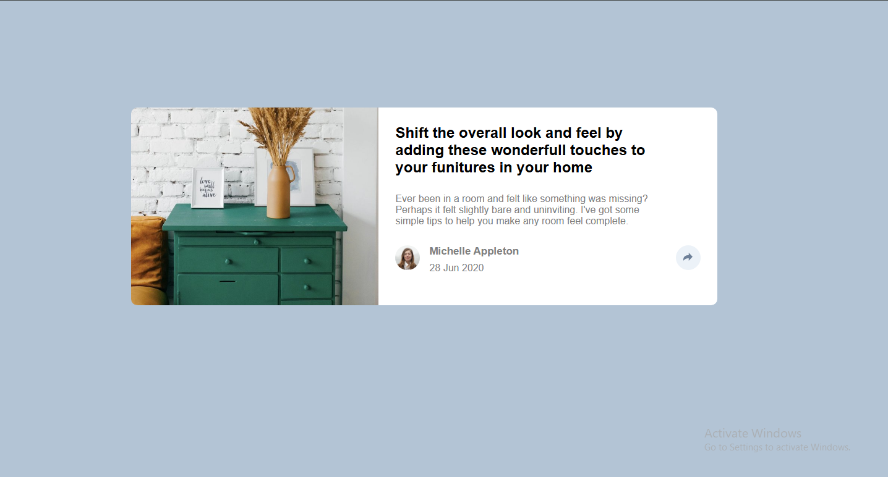

# Frontend Mentor - Article preview component solution

This is a solution to the [Article preview component challenge on Frontend Mentor](https://www.frontendmentor.io/challenges/article-preview-component-dYBN_pYFT). Frontend Mentor challenges help you improve your coding skills by building realistic projects. 

## Table of contents

- [Overview](#overview)
  - [The challenge](#the-challenge)
  - [Screenshot](#screenshot)
  - [Links](#links)
- [My process](#my-process)
  - [Built with](#built-with)
  - [What I learned](#what-i-learned)
  - [Continued development](#continued-development)
  - [Useful resources](#useful-resources)
- [Author](#author)
- [Acknowledgments](#acknowledgments)

**Note: Delete this note and update the table of contents based on what sections you keep.**

## Overview

### The challenge

Users should be able to:

- View the optimal layout for the component depending on their device's screen size
- See the social media share links when they click the share icon
- See how interactive the website is 

### Screenshot




### Links


- Live Site URL: [First-JS](https://first-js-ruby.vercel.app/)

## My process

### Built with

- Semantic HTML5 markup
- CSS custom properties
- Flexbox
- CSS Grid
- Mobile-first workflow
- Javascript


### What I learned

I learnt how to implement javascript in my code, and make many other design layout

To see how you can add code snippets, see below:

```html

<div id="sharePopup" class="share-popup">
    <span>Share</span>
    
    
    
</div>
```
```css

.share-btn{
    border: none;
    padding: 100%;
    border-radius: 50%;
    background-color:  hsl(210, 46%, 95%);
    width: 2%;
    height: 2%;
    display: flex;
    align-items: center;
    justify-content: center;
    margin-left: -50%;
    margin-top: 40%;
}

.share-popup{
    bottom: 0;
    left: 0;
    right: 0;
    top: auto;
    border-radius: 0 0 10px 10px;
    justify-content: center;
    position: absolute;
    padding: 9%;
    gap: 10%;

    pointer-events: none;
    transform: translateY(10px);
    transition: opacity 0.3s ease, transform 0.3s ease;
}

.share-popup::after {
  display: none;
}

.share-popup.active{
    visibility: visible;
    opacity: 1;
    background-color: hsl(217, 19%, 35%);
    transform: translateY(0);
    pointer-events: auto;
}


.share-btn.active{
      background-color:  hsl(210, 46%, 95%);
}

.share-btn {
    position: relative;
    z-index: 5;

}
```
```js
const shareBtn = document.getElementById("shareBtn");
const sharePopup = document.getElementById('sharePopup');

shareBtn.addEventListener('click', (event) => {
    event.stopPropagation();
    sharePopup.classList.toggle("active");
    shareBtn.classList.toggle("active");
});

document.addEventListener('click', (event) => {
    if(!sharePopup.contains(event.target) && !shareBtn.contains(event.target));
    sharePopup.classList.remove("active");
    shareBtn.classList.remove("active");
});```

### Continued development

I am not really good with javascript, I will try to improve and be my best.


### Useful resources

- [chatgpt](https://https://chatgpt.com) - This did almost everything for me.


## Author
- Frontend Mentor - [@Wizdev0](https://www.frontendmentor.io/profile/Wizdev0)
- Twitter - [@otutech](https://www.twitter.com/otutech)


